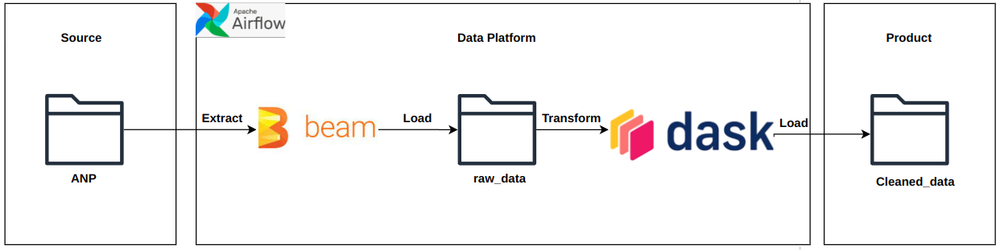
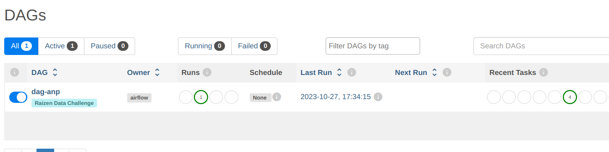
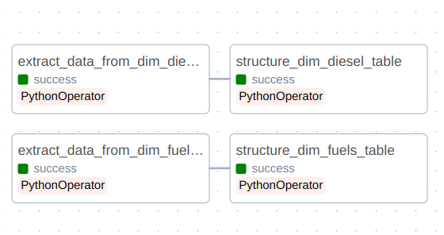

## Project description

The project's primary objective is to perform data extraction from the data source provided by the "Agência Nacional do Petróleo, Gás Natural e Biocombustíveis (ANP)." This data will undergo comprehensive processing to structure and format it as specified below:

### Data structure

The extracted data will be organized into a structured format with the following columns and corresponding data types:

- **year_month**: Date
- **uf**: String
- **product**: String
- **unit**: String
- **volume**: Double
- **created_at**: Timestamp

### Repository sctructure
```sh
├── dags
│   ├── dag_anp.py
│   ├── datalake
│   │   ├── clean_data
│   │   │   ├── 2023-10-27_dim_diesel.parquet
│   │   │   └── 2023-10-27_dim_fuels.parquet
│   │   └── raw_data
│   │       ├── 2023-10-27_dim_diesel.csv
│   │       └── 2023-10-27_dim_fuels.csv
│   ├── dataset
│   │   └── vendas-combustiveis-m3.xls
│   ├── include
│   │   ├── constants.py
│   │   ├── extract.py
│   │   └── transform.py
├── docker
│   ├── docker-compose.yaml
│   └── Dockerfile
├── docs
│   ├── airflow_tasks.png
│   ├── airflow_ui.png
│   └── architeture.png
├── README.md
├── requirements.txt
└── scripts
    ├── project_config.sh
    └── setup_docker_compose.sh
``````

In the "dags" directory, you will find the following:

- `dag_anp.py`: This file contains the code for the Directed Acyclic Graph (DAG) for your project.
- `datalake`: A subdirectory that stores data related to the data lake operations.
  - `clean_data`: A subdirectory that holds cleaned data in Parquet format.
  - `raw_data`: A subdirectory where the raw data is stored.
- `dataset`: This subdirectory may contain the original dataset(s) used in your project.
- `include`: The "include" directory is for Python modules and scripts used in your project.

The "docker" directory contains Docker-related files for your project:

- `docker-compose.yaml`: A Docker Compose configuration file.
- `Dockerfile`: A Dockerfile for building container images.


The "scripts" directory includes various scripts used in your project:

- `project_config.sh`: A script for project configuration.
- `setup_docker_compose.sh`: A script for setting up Docker Compose.


### On-premises architecture
Following an ELT approach, we first extract raw data without any modifications to a 'raw_data' folder using Apache Beam. Subsequently, the data is transformed using Dask and loaded into the 'cleaned_data' folder



**DISCLAMER**: The Apache Beam is being used in Direct Runner mode. For a cloud environment, it may not be advantageous to use it unless you are working with the GCP (Google Cloud Platform) provider.

### How to run the project

To start the project runs the following command in the terminal:

```sh
bash scripts/setup_docker_compose.sh start_airflow
```

If everything goes well, wait a few seconds and see the airflow in: http://localhost:8080/.

To login:

- **username**: airflow
- **password**: airflow

If everything goes smoothly, it will display the dag-anp on your screen:



Inside the DAG, there are the following tasks:



**Disclaimer**: To execute the tasks, the trigger has been configured to be manually initiated..

To stop the project, just runs on the terminal:
```sh
bash scripts/setup_docker_compose.sh stop_airflow
```